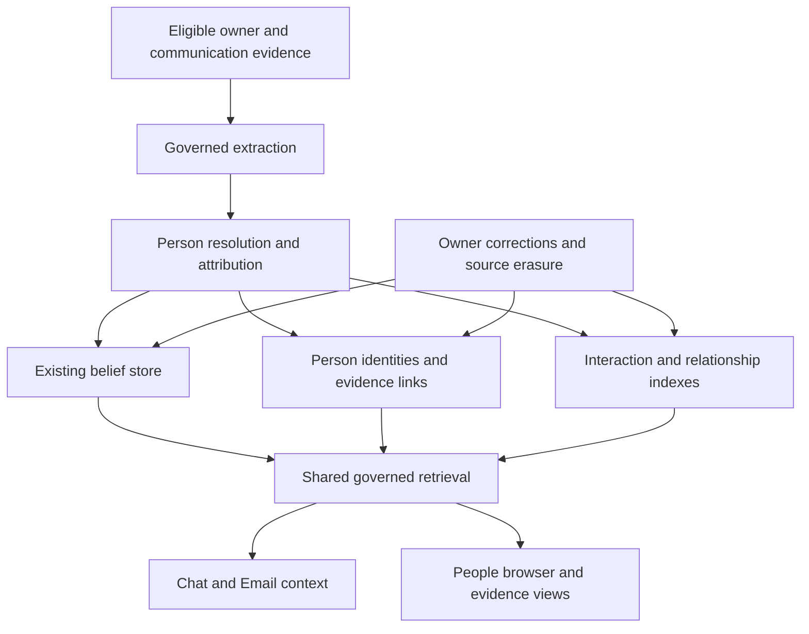

# People and relationship memory

## 1. Proposal and outcome

**Build a first-class People layer over Veetbot's governed memory system.**
Each person has a stable identity linking separately correctable facts,
relationships, interactions, and commitments. Chat, Email, and the native
People browser use the same records and the same evidence rules.

The owner approved implementation on 2026-09-15. This document specifies
**Milestone 28**, an independent workstream under accepted
[ADR-0100](../adr/0100-people-and-relationship-memory.md). It expands the
[engineering plan](engineering-plan.md) only for People-specific identity,
temporal relationships, person-linked history, and governed People edits.
The verified sequential ceiling stays at Milestone 12. Historical imports,
provider evaluation spend, PR creation, merging, and deployment retain the
explicit scope described below. The implementation and its 36 gates remain
in progress until their evidence is complete.

### Availability amendment

Under [ADR-0101](../adr/0101-people-availability-without-evaluation-gates.md),
People is enabled by default with its complete implemented functionality.
Automatic Chat and Email formation and scoped imports require no evaluation
artifact, reviewed corpus, private acceptance run or pilot allowlist. The quality
requirements below measure milestone completion; they do not block runtime
availability or release. Explicit shutdown, provider availability, authorization,
source admission, privacy, correction, erasure and finite budgets remain enforced.
This amendment supersedes earlier activation-gating statements in the historical
implementation checkpoint.

### The product promise

Veetbot should answer, with evidence and appropriate uncertainty:

1. How do I know this person, and how are they connected to others in my life?
2. What matters to them, and what background is relevant to this conversation?
3. What happened when we last interacted? What did we discuss or decide?
4. What have I promised them, and what are they expecting from me?
5. What has changed since we last spoke?
6. Why does Veetbot believe this, and how can I correct it?

The feature is successful when it improves a real reply, meeting preparation,
or recollection without requiring the owner to restate their relationships.
A directory of names alone does not meet the acceptance criteria.

### Representative acceptance stories

All names and situations in this document are fictional examples.

| Owner input or task | Required behavior |
| --- | --- |
| “My sister Maya is starting a bakery with her partner Jules.” | Represent Maya and Jules separately; link the owner to Maya, Maya to Jules, and both people to the supported bakery context. Each claim has its own evidence. |
| “My other sister, Nora, is visiting.” | Create a distinct person. Do not overwrite Maya or resolve every “my sister” to one person. |
| “Help me reply to Maya.” | Retrieve the relevant relationship, recent correspondence, and open commitments within the existing context budget. |
| “What did we decide last time?” | Search that person's interaction history across eligible sessions and communications; distinguish the last recorded exchange from the last possible real-world interaction. |
| “Maya left Acme in June.” | End the current affiliation with supported date precision; preserve the earlier affiliation as history. |
| “The Alex from the board is not Alex from my running club.” | Keep both identities separate and correct mistaken links, summaries, and rankings. |
| “I promised Jules an introduction.” | Record who owes what to whom, its source and status; a later draft does not prove that the introduction happened. |
| “Forget what you remember about Maya.” | Remove the targeted derived memories and person links, invalidate dependent summaries, and prevent replay from recreating them. Explain source-retention scope accurately. |

## 2. Current foundations and concrete gaps

This assessment is grounded in repository revision
`abd1b299818d18595c2bf80f176c7c0a1f66e1d5`. It is not a production activation
audit. Implementation must refresh these locations against its actual base.

| Area | Existing foundation | Work this proposal adds |
| --- | --- | --- |
| Beliefs | `src/agent_core/domain/memory.py` has belief types, subjects, provenance, authority, sensitivity, validity, conflicts, and evidence clocks. | Stable person references independent of subject text; structured relationship endpoints and complete attribution. |
| Formation | `memory/formation.py`, `distillation.py`, and `provider_extraction.py` form governed claims; older extractors can reduce named relationships to generic roles. | Evaluated person-aware extraction, attribution, identity resolution, and person-specific corrections. |
| Episodes | Integrated episodes retain ordered user-event provenance. `EventEpisodeSearch` and `memory.recall_episodes` search the current session. | An indexed, bounded person-history query across owned sources and sessions. |
| Retrieval | Structured and lexical recall, validity filters, budgets, conflict rendering, and recorded traces. | Person resolution and person-linked retrieval before text ranking; bounded relationship traversal and interaction context. |
| Email | `application/email.py` and `runtime/email_tasks.py` retain learning context and source-qualified observations. `memory/email_semantics.py` gates semantic formation on exact evidence. | A shared People identity bridge and read model. Do not assume a complete canonical correspondent index already exists. |
| Native UI | `MemoryBrowserView.swift`, `MemoryDetailView.swift`, and `MemoryViewModel.swift` browse beliefs. | A People collection, person detail, timeline, evidence, correction, and identity repair workflows. |
| Erasure | Governed belief deletion, session deletion, email source erasure, and replay suppression. | Complete dependency tracking through person links, relationships, interactions, identity repairs, caches, and imports. |

The existing specifications own the inherited contracts:
[formation](memory-formation-and-consolidation.md),
[adaptive distillation](adaptive-memory-distillation.md),
[retrieval](memory-retrieval-and-ranking.md),
[memory browsing](memory-read-api-and-browser.md), and
[email experience](email-experience.md).

## 3. Scope and architectural decisions

### Included in Milestone 28

- Stable person identity, contextual aliases, tentative mentions, owner-confirmed
  identity, and reversible identity merge/split operations.
- Directed, dated relationships between the owner and a person and between
  people. Small organization references support employment, boards, and projects.
- Personal facts, interests, preferences, important events, interactions,
  decisions, and open commitments linked to their participants.
- Formation from existing eligible owner and communication sources; forward
  capture, bounded linking of existing records, and explicitly requested history
  import with declared dates, accounts, and cost limits.
- Automatic relevant person recall, deliberate history lookup, and the native
  People interface on iPhone, iPad, and Mac.
- Corrections, attribution, source inspection, privacy controls, erasure,
  evaluation, operational diagnostics, and release evidence.

### Architectural shape

People is an entity dimension, not another `BeliefType`. A preference can belong
to Maya, a decision can concern Maya and Jules, and a relationship can connect
the owner to Maya. Keep existing belief kinds and independent correction units.

Use PostgreSQL, existing transactions, the durable worker, and shared in-memory
repository contracts. No graph database, vector dependency, external people
service, or new infrastructure is needed for this scope. Relationship tables
are a deliberately bounded temporal graph: acknowledging that extension is
necessary even though it uses ordinary relational storage.

A profile is a rebuildable view of records. It cannot become a second writable
biography with its own unsupported facts. A summary sentence must identify its
supporting claim or interaction revisions, and a correction invalidates every
dependent summary. Start with deterministic grouped summaries; generated prose
is an optional later optimization requiring its own evaluation.

### Explicit exclusions

General graph reasoning, arbitrary multi-hop traversal, public identity
enrichment, address-book import, social-network scraping, photo/face recognition,
new communication providers, embeddings, automatic persona edits, and inference
of sensitive traits from weak cues remain outside this milestone. User-stated
sensitive context remains eligible only under existing explicit storage policy.

People knowledge supplies context; it does not authorize contacting someone,
changing recipients, granting tools, scheduling reminders, or sending messages.
Follow-up suggestions can hand off to existing workflows when the owner asks.
No unattended relationship-maintenance campaign or new background mailbox
monitor is included.

## 4. Domain and persistence model

All rows, foreign keys, uniqueness rules, and queries are tenant- and
principal-scoped. Opaque identifiers never encode a name, address, or phone
number. Mutable resources have positive revisions and optimistic concurrency.

| Value or table | Core fields and responsibility |
| --- | --- |
| `Person` | UUID, owner scope, display label, state (`provisional`, `active`, `merged`), revision, created/updated times. Identity presence is separate from confidence in individual facts. |
| `PersonIdentifier` | Person, kind, provider namespace, normalized value, sensitivity, source support, assignment interval, and verification state. Names are search aliases; addresses and handles are contact identifiers. |
| `PersonMention` | Source reference, exact span or validated header location, contextual role, proposed/resolved person, ambiguity state, and resolver version. Can exist without creating a directory entry. |
| `PersonMemoryLink` | Person, existing belief ID, semantic role (`subject`, `object`, `speaker`, `mentioned`), source support, and revision. One belief can link several people. |
| `RelationshipAssertion` | Backing belief ID, typed source and target references, predicate, directed roles, effective interval with precision, and assertion revision. Authority and sensitivity come from the backing evidence, not a separate confidence score. |
| `OrganizationReference` | Scoped ID, supported name/aliases, source support. A bounded endpoint for work, board, and project relationships; no organization graph or enrichment. |
| `Interaction` | UUID, channel, kind, event-time interval/precision, direction, bounded summary, source references, revision, and visibility. Covers observed exchanges and owner-reported events with different labels. |
| `InteractionParticipant` | Interaction, person or unresolved mention, role (`sender`, `recipient`, `participant`, `mentioned`), attribution certainty, supporting source. Being mentioned is not participation. |
| `Commitment` | Backing claim/evidence, debtor, beneficiary, task description, supported due time/precision, state, state evidence, and related interaction IDs. |
| `PeopleSourceLink` | Source kind, owner/session/event sequence, provider account/thread/message or receipt key, original author, observation time, source revision, exclusion state, and derivation version. Content stays with its governed source. |
| `PeopleIdentityOperation` | Operation ID, affected identities and expected revisions, explicit decision source, link-level change set, undo dependencies, and outcome. No duplicate source text. |
| `PeopleImportJob` | Authorized scope, bounded date range, source filters, budget/reservations, checkpoints, resolver/policy versions, coverage, failures, and cancellation state. |

Physical schema can combine narrow link tables when it preserves their
constraints. Domain values and shared repository contracts remain explicit.
Do not hide all invariants in an unconstrained JSON payload.

The owner endpoint is a typed reference to the authenticated principal, not a
second person account or another principal inferred from a name. Historical
revisions cover identifier assignments, relationship assertions, participant
links, and commitment states so `known_at` never consults today's mapping to
answer yesterday's question. Record intervals are half-open and revisions
cannot overlap for the same assertion or identifier assignment.

### Source and uniqueness rules

- An event sequence is unique only with its session. A Gmail identifier is
  qualified by provider and account. Never join on a bare name, sequence, or
  message ID.
- A stable source observation and extraction version produces one derivation
  key. Duplicate deliveries, thread rereads, quoted copies, and retries cannot
  create independent evidence or inflate interaction counts.
- Cross-account copies retain all source receipts but count once only when
  message headers and canonical content establish the same communication.
  Uncertain duplicates remain marked and cannot be used as independent support.
- Keep source mentions and their original assignments through a merge. A
  redirect identifies the current canonical person without rewriting evidence.
- Every projection can enumerate its complete source dependencies for erasure.
  A multi-source fact remains only when surviving sources independently support
  the entire fact; partial support requires a smaller re-derived claim.

Add indexes for scoped normalized identifiers; `(person_id, belief_id, role)`;
relationship endpoints/predicate/effective time; participant/event time/ID;
source derivation keys; and active import leases. Force RLS on new tables and
use scoped composite foreign keys to reject cross-owner links at write time.

## 5. Identity resolution

Resolve people before assigning claims or fetching person context. Identity
confidence and claim confidence are separate: correctly identifying Maya does
not make a forwarded statement about her true.

### Resolution order

1. Apply owner corrections, prior split decisions, and suppression rules.
2. Use an explicitly selected person or owner-confirmed mapping.
3. Match an exact, validated channel identifier to its time-valid assignment.
4. Use a unique, previously evidenced alias within its supported context.
5. Keep unresolved candidates when multiple identities fit. Ask a targeted
   question only when choosing is necessary for the current task.

Names, titles, domains, shared contacts, semantic similarity, and an LLM score
alone cannot merge people. A display name copied from an email is not verified
identity. A new personal address may create a provisional identity; role
mailboxes, mailing lists, automated senders, and shared phones remain contact
endpoints until evidence supports a person. The same contact endpoint may have
sequential assignments; a reassigned work address must not inherit the former
employee's relationships.

Normalize conservatively: Unicode normalization and case-folded names for
search; provider-aware address normalization without universal dot or plus-tag
rewriting; E.164 phones only when a country context is known; channel-qualified
handles. Preserve the original display form and normalization version.

“My daughter” is a contextual role, not a globally unique person key. Unnamed
people can have a stable provisional identity and gain a name later. Multiple
daughters remain distinct; pronouns bind only when source-local participant
context resolves them. Otherwise retain the unresolved mention and useful
unambiguous facts without guessing its identity.

### Merge and split

Owner-confirmed merge is an atomic, revision-checked operation with a preview
of identities, aliases, linked facts, and affected history. It does not merge
the beliefs themselves or increase their evidence count. Keep a canonical
redirect and an operation ledger, invalidate dependent views, and rescore only
affected email/context projections.

Split reassigns selected identifiers, mentions, and source-linked claims. Claims
supported by both resulting identities become unresolved pending re-evaluation;
they are never copied as established facts to both. Record a durable “these
identities are distinct” constraint so the next extraction cannot merge them
again. Inverse operations restore original assignments when revisions permit;
later conflicting edits require a fresh preview, not a blind undo.

Automatic resolution can attach new evidence to an established identity under
the rules above. Merging two established people always requires an explicit
owner decision. Ordinary memory formation continues autonomously.

## 6. Relationships, time, and commitments

### Relationship vocabulary

Use typed, directional endpoints: owner-to-person, person-to-person, or
person-to-organization. Initial predicates cover kinship, partner/spouse,
friend, colleague/collaborator, introduced-by, reports-to, employment, founder,
board membership, and investor relationship. Preserve a bounded descriptive
qualifier when a supported relationship is more nuanced than the vocabulary.

Inverse labels such as parent/child can be rendered deterministically from
one assertion. Do not independently store both directions or infer friendship,
family membership, investment, or trust through transitivity. No uniqueness
rule assumes one child, one employer, or one concurrent partner.

Importance has separate dimensions: explicit owner importance, relationship
context, ongoing shared work, and dated reciprocal interaction evidence.
Message volume alone does not establish closeness. A rarely contacted family
member can remain important. An email urgency score cannot become a judgment
of the person's importance in the owner's life.

### Four distinct clocks

| Clock | Meaning |
| --- | --- |
| Effective time | When the relationship or fact held in the world, with exact/day/month/year/unknown precision. |
| Occurred time | When the interaction happened; can be approximate or owner-reported. |
| Evidence time | When the original supporting statement/message occurred. Imports and citations do not renew it. |
| Recorded time | When Veetbot stored or revised the assertion. Enables “what did you know then?” without future evidence. |

Use UTC for instants and retain source timezone and calendar precision. “Last
June” is resolved relative to its source, not the import date. Unknown dates
remain unknown. Preserve both the original statement and subsequent correction
lineage through governed evidence, rather than manufacturing an exact start.

Historical APIs distinguish `as_of` (effective world time) from `known_at`
(recorded knowledge time). Both are optional; current context defaults to now.
Implement append-only assertion revisions so a late correction cannot leak
into a historical replay that predates it. Existing belief validity fields
alone do not fully supply this two-clock query.

### Persistence and expiry

Person identity and dated interaction records persist while their source
support and owner retention policy permit. They do not expire because contact
has become infrequent. Claim freshness still governs whether a statement can
be presented as current.

The accepted narrow lifecycle amendment is: direct owner-stated kinship and
owner-confirmed identity mappings remain eligible until corrected, retracted,
or erased. They do not require annual conversational reinforcement. A spouse,
friendship, job, current preference, or inferred relationship retains its
existing applicable evidence horizon unless explicitly remembered by the owner.
Stale relationships remain visible as “last known,” never silently as current.
This amendment must carry versioned evidence before activation; linking a
person cannot silently change any other lifecycle.

Current communication-derived claims retain their existing tentative horizon.
Their dated source reports and historical interactions remain available for
deliberate historical lookup. “Maya said she worked at Acme in 2022” is valid
history even when it no longer supports “Maya works at Acme.” Repeated retrieval
never refreshes evidence, certainty, or authority.

### Commitments and significant events

Commitments use `proposed`, `open`, `completed`, `cancelled`, or `uncertain`.
Requests, offers, and promises are distinct. Record debtor, beneficiary,
description, source, and any supported deadline. An outgoing draft is not a
completed action; neither a read receipt nor elapsed time proves fulfillment.
Completion requires a linked observed result or an explicit attributed report.

One-off events belong in interaction history when useful: meeting, visit,
introduction, trip, milestone, decision, or significant disagreement. They do
not all become durable current beliefs. Reported interactions and directly
observed communications have visibly different attribution.

## 7. Formation and source integration

### Source admission

| Source | Admission and attribution |
| --- | --- |
| Owner Chat and authenticated paired-surface messages | Owner assertions under existing identity and formation gates. “Maya told me…” remains an owner report of Maya's statement, not direct evidence of its truth. |
| First-party Gmail received/Sent evidence | Existing account-qualified contracts, exact message spans, sender/recipient roles, quoted/forwarded attribution, and semantic-policy activation. Sent placement alone does not prove personal authorship. |
| Device SMS | Existing admitted receipt/channel metadata. Rich body-derived facts require a separately evaluated amendment to the current metadata-only memory adapter; do not duplicate the SMS body into another event. |
| Existing memories and integrated episodes | Deterministic indexing of valid support; re-extraction of old source text only through the explicit bounded replay/import contract. Summaries are not new independent evidence. |
| Calendar, contacts, arbitrary web/MCP, public callers, assistant output | No new admission. Milestone 27 call-derived memory remains excluded. Generated drafts and Veetbot's own person summaries never corroborate themselves. |

The first release delivers Chat and eligible Gmail content plus existing
metadata-level SMS history. Rich SMS semantics, call transcripts, and additional
providers are explicitly later source extensions, not hidden prerequisites.

### Processing sequence

1. Validate the owned source and source version; check source exclusion and
   person suppression before provider work.
2. Extract separately grounded mentions, atomic claims, relationship endpoints,
   significant interactions, and commitments in bounded batches.
3. Resolve identities locally from admissible evidence. Provider responses refer
   to source-local mention IDs, not arbitrary database identities they invent.
4. Apply existing policy, sensitivity, authority, portability, and injection
   checks to each claim. A person link never upgrades any of these properties.
5. Apply owner corrections and identity split constraints; match contradictions
   using person IDs, predicate, roles, polarity, and time, not word overlap alone.
6. Commit beliefs and People links, interaction revisions, audit outcomes, and
   the consolidation watermark atomically under a source/owner revision fence.
7. Invalidate affected projections. Retries reread source and identity revisions
   and cannot recreate erased sources or double-count evidence.

Provider work stays outside database transactions. Invalid candidates fail
individually; source-wide structural failures take the existing audited fallback
and bounded retry path. Corrections win races with imports and background work.

### Versioning, cost, and capacity

Do not modify evaluated `formation@9`, `formation@10`, or `email-semantic@1`
in place. Introduce a successor owner-formation policy and a separately evaluated
email policy with person-aware outputs. The successor owner policy is `formation@11` and the email policy is
`email-semantic@2`; both are available without evaluation artifacts under ADR-0101. Deterministic indexing of existing
beliefs has its own linker version and does not claim new semantic knowledge.

For owner distillation, keep the three-call segmented shape: integration,
anticipation, distillation. Extend the new version's structured outputs; no
provider call per person, fact, or relationship. Keep the existing 32-claim
global and six-per-event ceilings initially. Links are not extra beliefs, but
must be bounded too: at most 64 mentions, 64 proposed links, and 32 interaction
proposals per segment, with an explicit overflow disposition for each omitted
source unit. Ordinary multi-person examples must fit and form completely.

Email extraction should reuse its admitted assessment batch under its new
evaluated version rather than make a second assessment call for each person.
Charge all People work on email evidence to the existing aggregate email
allowance as well as the job/run limits. A new People job cannot reset the
daily or rolling budget. Ambiguous reservations remain charged.

Existing provider egress rules still apply. In particular, existing sensitive
memory is filtered from auxiliary extraction context today. Resolve sensitive
person mappings locally; do not send a whole private directory as prompt
context to improve matching. Source egress uses the source's existing policy.
If a required operation cannot fit those rules, it remains unavailable pending
a specific policy decision rather than lowering sensitivity.

## 8. Retrieval and conversational use

### Person context assembly

Use a `PeopleContextService` composed from identity resolution, the existing
governed memory retriever, and the new indexed history repository. Its output is
bounded task data with source citations and a persisted trace.

1. Resolve an explicit person selection or unambiguous names/roles from the
   current task and working state.
2. Apply tenant, principal, authority-context, sensitivity, source visibility,
   suppression, and temporal filters before candidate counts or ranking.
3. Retrieve current relevant beliefs by stable person link, preserving the
   existing confidence/authority treatment and conflict pairs.
4. Add bounded recent interactions, open commitments, and, when relevant,
   one-hop relationships. Historical deep lookup is explicit and paginated.
5. Rank for the task, preserve confirmed relationship context against noisy
   tentative claims, deduplicate by evidence, render uncertainty and provenance,
   and record exactly what was shown.

An ambiguous “Alex” returns disambiguation candidates with only permitted
labels. It cannot combine both people's private contexts into one speculative
profile. A selected email correspondent supplies task identity but never
rewrites verified reply recipients.

Disconnected source accounts make live source navigation unavailable; they do
not automatically erase independently permitted shared memories. Explicit source
exclusion/clear-learning decisions remove derived eligibility. Distinguish those
states in retrieval and in the source-link UI, preserving the email lifecycle
contract rather than treating every unavailable provider as an erasure request.

### Budgets and caching

People context shares the existing retrieved-context allocation; it is not an
additional unbounded prompt section. Start with at most three focal people,
20 combined items, five recent interactions per focal person, and ten one-hop
relationship candidates, all subordinate to the existing 2,000-token task
recall ceiling and deterministic truncation rules. Explicit lookup can page;
it does not raise the run's budget. Conflict pairs travel together or receive a
single unresolved-conflict marker when neither full pair fits.

Keep the session-open prefix stable. New People context and corrections enter
Region B, using the existing correction-delta mechanism. Do not preload the
entire directory in Region A. Cache keys include owner, requested ceiling,
person/identity revisions, source exclusions, query/time filters, and policy
versions. A deletion invalidates caches and blocks future injection; previously
delivered text follows existing session/source erasure semantics.

### Agent tools

| Tool | Bounded purpose |
| --- | --- |
| `people.search` | Resolve a person from a name, alias, role, or selected channel endpoint; return candidates and ambiguity. |
| `people.context` | Get a task-relevant profile for up to three explicit person IDs with current facts, relationship evidence, and open threads. |
| `people.history` | Page dated interactions for explicit people and time filters across owned sources, with an optional historical knowledge cutoff. |

All three are ordinary read-only tools requiring exact `people.read`, returning
`TrustLevel.MEMORY`, with existing run budgets and a maximum 64 KiB response.
Schemas expose identifier counts, date bounds, page limits, and closed enums;
executable validation enforces the same limits. The service derives the
effective sensitivity ceiling from the caller and surface; an argument cannot
raise it. Availability is governed at advertisement and invocation under the
existing pinned-tool contract.

Extend the governed `memory.remember` path with optional validated person
references in a new tool version for explicit conversational facts. Automatic
formation and owner corrections route through the same service. Model-produced
references must match the cited owner message or explicit selection. Identity
merge/split and broad forgetting remain explicit native/CLI operations in this
milestone; recalled data alone cannot authorize them.

## 9. People experience and HTTP contract

### Native experience

Add People as a collection within Memory, with direct entry points from an
email correspondent and relevant Chat citations. Preserve Chat/Email mode,
selection, draft, and streaming state. Use the existing core identity and
connection; People is not a separate agent or persona.

The list supports name/alias search, owner pins, relationship filters, and
recent interaction sorting. Pins express importance and do not refresh factual
evidence. Keep ambiguous/unnamed mentions discoverable in a bounded review
section rather than flooding the default directory with every passing name.

Person detail has five sections:

1. **Overview:** name, supported relationship to the owner, brief grounded
   background, and any uncertainty or stale-data labels.
2. **Relationships:** readable links to people and organizations, with current
   and historical dates. A graph visualization is optional, not required.
3. **History:** dated exchanges and reported events, source channel, direction,
   participants, decisions, and source navigation.
4. **Open threads:** commitments and unresolved topics; no automatic sends or
   reminders. “Prepare for a conversation” starts ordinary Chat with this person.
5. **Facts and evidence:** inspect, correct, mark changed, reject, remove,
   affirm where supported, and inspect identity assignments.

Show coverage such as “Email analyzed: recent 90 days; earlier Chat history
not imported.” “No recorded interaction” does not claim no interaction occurred.
Loading, partial pages, source unavailable, stale cache, budget pause, missing
scope, disabled feature, duplicate identity, and concurrent edit all have
distinct recoverable states. Already loaded content survives a later page error.

Cross-device changes use revisions and refresh on foreground return. No
offline-authoritative edits. Support VoiceOver, Dynamic Type, keyboard access,
compact/regular iPad layouts, and Mac navigation using the existing Swift lanes.

### HTTP routes

The route contracts below are Milestone 28 requirements; activation depends
on their implemented checks and the master switch.

| Method and route | Scope | Contract |
| --- | --- | --- |
| `GET /v1/people` | `people.read` | Search/list; relationship/state filters; keyset pagination. |
| `GET /v1/people/{id}` | `people.read` | Revisioned profile, coverage, permitted aliases, and bounded section summaries. |
| `GET /v1/people/{id}/relationships` | `people.read` | Paginated directed links with `as_of` and `known_at`. |
| `GET /v1/people/{id}/history` | `people.read` | Paginated timeline; time/channel/kind filters, unknown-date bucket, and coverage. |
| `GET /v1/people/{id}/identity-evidence` | `people.read` | Bounded, sensitivity-filtered claim/mention/alias/history assignments for explicit repair; stable cursor and original evidence references. |
| `GET /v1/people/{id}/facts` | `people.read` | Person-linked governed beliefs, status/time filters, and public evidence references. |
| `GET /v1/people/{id}/evidence/{reference}` | `people.read` plus source read scope | Minimal authorized source view or navigation target; never raw provider JSON. |
| `POST /v1/people` | `people.write` | Explicit owner-created identity, with source event for the assertion. |
| `PATCH /v1/people/{id}` | `people.write` | Label, alias assignment, or owner pin; expected revision and typed operation. |
| `POST /v1/people/{id}/corrections` | `people.write` | Person-linked claim correction, changed fact, rejection, or supported affirmation through governed memory. |
| `POST /v1/people/identity-operations` | `people.write` | Preview/apply merge, split, or compatible undo with exact affected revisions. |
| `POST /v1/people/{id}/forget` | `people.write` | Explicit derived-memory removal plan and idempotent application with a receipt. |
| `GET /v1/people/operations/{id}` | `people.read` | Owner-bound operation/erasure receipt and completion state, including after the person is no longer readable; no deleted content. |
| `POST /v1/people/imports` | `people.write` plus source read scopes | Explicit scoped import request, date range, exclusions, and finite budget. |
| `GET /v1/people/imports` | `people.read` | Discover visible saved imports with bounded, owner-bound pagination for device recovery. |
| `GET /v1/people/imports/{id}` | `people.read` | Coverage, progress, cost/reservations, failures, and remaining-work estimate. |
| `POST /v1/people/imports/{id}/cancel` | `people.write` | Fence further slices; preserve completed evidence and charged usage. |

Every read requires an explicit sensitivity ceiling, clamped to the server's
surface ceiling. All writes enforce the same visibility boundary on targets
and return only the caller's permitted projection. Foreign, suppressed, and
above-ceiling IDs are indistinguishable from missing resources. Source evidence
requires both People access and the relevant existing source permission.

List limits default to 50 and cap at 100; cursors bind principal, filters,
ceiling, sort, time cutoffs, and a read watermark. Identity changes that invalidate
a walk return a restartable cursor-conflict response instead of silently
skipping people. Date-ordered history uses an event-time/ID tie-breaker and an
explicit unknown-time bucket. Register static import/operation routes before
dynamic UUID routes and cover routing precedence at the API boundary.

Writes use `Idempotency-Key`, typed closed payloads, and `expected_revision`.
An exact retry returns the same result; key reuse with changed content or stale
revisions returns conflict. Preview tokens bind the exact operation and source
revisions with a short expiry; applying does not silently broaden the preview.
Use the existing error envelope and cache-control conventions. No raw addresses,
names, content, or credentials in errors or operational logs.

Use `AGENT_PEOPLE_ENABLED` as the default-on operational switch for new
formation, linking, routes, tools, and context integration; disabling it retains
existing data and keeps cleanup workers operational. An optional API exposure
switch can be added only if deployment requires separate control. Worker
formation selects `formation@11` when People is enabled and no legacy policy is pinned.
Email selects `email-semantic@2`; neither requires an evaluation artifact. The existing `/v1/memories` routes
remain GET-only. Person-linked corrections are an explicit new public write
capability authorized by ADR-0100; Milestone 17's read-only contract remains intact.

## 10. Correction, privacy, and erasure

Owner corrections outrank inferred claims and survive replay, retry, backfill,
merge/split, and policy upgrades. Preserve distinctions between “never true,”
“was true but changed,” “belongs to a different person,” and “forget this.”
Correction is evidence; deletion removes content and retains only permitted
suppression information.

### Operation semantics

| Operation | Effect |
| --- | --- |
| Correct a fact | Governed replacement/rejection; retain allowed audit lineage; rebuild affected profiles. |
| Correct identity | Reassign supporting mentions and links; retain a replayable identity constraint. |
| Remove one fact from memory | Remove the belief and derived copies; retain minimal content-free replay suppression under existing deletion rules. |
| Forget a person from memory | Remove that person's identities, aliases, links, person-specific beliefs, summaries, commitments, and person-specific history projections; suppress re-formation from covered sources. |
| Clear source learning | Apply existing source-erasure machinery and remove every dependent People contribution; retain independently supported owner facts. |
| Delete session/principal | Extend the existing transaction family to every new row, cached projection, import, source link, and identity-operation record. |

Person forgetting is not deletion of Gmail messages or every original Chat
message. Its review surface explains exactly which derived data and supporting
source copies each available operation removes. Existing source/session deletion
remains the way to remove original stored content. Do not claim provider-side
deletion or removal from already delivered external messages.

For shared group interactions, removing one person invalidates the entire
derived summary; rebuild only from surviving permitted evidence. Do not retain
the removed person's name in the summaries of other people. Where safe
separation is impossible, remove the derived record and show reduced coverage.
Independently supported facts about other people survive.

Suppression uses scoped opaque source/mention keys and protected keyed hashes
where matching is needed. Never suppress every person with a common name.
Repeated old evidence cannot recreate a forgotten person; a new explicit owner
instruction can start a new record under an explicit re-admission operation.
Principal erasure also removes suppression material.

Erasure starts by atomically blocking visibility and new derivations, fencing
worker/import commits, then removes dependencies in bounded resumable batches.
Report `cleanup_pending` until all live copies are removed. The erase worker
must enumerate beliefs, episodes/projections, relationship/history rows, caches,
recall traces, imports, email learning projections, artifacts, and identity
operation metadata. Existing session/source cleanup owns original event and
checkpoint content. Preserve the existing encrypted-backup maximum of 35 days;
restore must reapply erasure receipts before serving restored data.

Sensitivity is field- and relationship-aware. Hiding a fact must also hide a
revealing alias, relationship endpoint, count, search suggestion, or evidence
snippet. Person detail and graph edges apply visibility filters before counts
and pagination. Names cannot become high-cardinality diagnostic labels.

No new third-party data egress or notification payload content is authorized.
People context remains data at memory trust and cannot change persona,
credentials, approval rules, caller identity, or send targets.

## 11. Migration, history import, and operations

Operator procedures are in [People memory operations](../people-operations.md).

### Additive migration and compatibility

1. Add empty People tables, indexes, source links, and policy/version fields.
   Keep existing string subjects readable; person links are optional.
2. Ship read/write parity with the feature disabled, including principal/source
   erasure and rollback tests before collecting any new People data.
3. Link existing valid beliefs deterministically where their own provenance
   supports an unambiguous person. This does not re-mine old conversations,
   alter evidence dates, or upgrade policy/authority.
4. Enable forward capture for the evidenced source policies. Old records without
   a resolvable person remain available in the ordinary memory browser.
5. Offer bounded historical import as a separate operation with source coverage,
   failure counts, costs, and cancellation. Never mark an entire mailbox complete
   after processing only its allowed 90-day window.

Migration tests cover a populated pre-People database, clean install, stepwise
upgrade, safe downgrade where lossless, and application rollback with new tables
left intact. Rollback disables new readers/writers and retains source provenance;
it never silently drops new user data or bypasses schema compatibility checks.

### Bounded read implementation

PostgreSQL computes the current hidden-dependency closure once per read. Each
candidate revision checks its own source/assignment links against that closure;
historical reads retain their original links while applying current privacy.
Owner/sensitivity and hidden-head indexes bound the closure seed. Indexed head
and assignment probes preserve filtering before pagination. People reads disable
LLVM JIT within their current transaction: compilation overhead is unsuitable for
these short page queries. Server and persistent connection defaults are unchanged.

The opt-in synthetic integration case `tests/integration/test_people_load_m28.py`
seeds the declared 10,000-person, 100,000-belief, one-million-participant-link load.
It records first-read and warm p50/p95, query plans/buffers, index/storage sizes,
and additional automatic-recall latency. First read after loading is explicitly
not an evicted-cache measurement. Run it only against a disposable migrated
database with `RUN_PEOPLE_LOAD_TESTS=1`; the integration fixture clears that
database. This bounded read measurement alone does not establish import/Chat
contention, provider cost, cold-cache behavior, or the complete performance gate.

### Historical import contract

[ADR-0096](../adr/0096-bounded-email-catch-up.md) limits current automatic email
learning to 90 days. People does not widen that limit. Previously stored older
memories can be linked; reading cached older mail does not imply authorization
to launch an unbounded mining job.

An explicit import names source accounts/sessions, inclusive start and exclusive
end, optional confirmed person/identifier filters, excluded sources, maximum
records, and a finite monetary cap. A preview reports known counts and an
estimate range; unknown counts are labeled unknown. Older email analysis is
authorized only by the specific requested range and budget. Person-filtered
search is restricted to confirmed identifiers; otherwise use a clearly stated
source/date search scope and disclose its partial coverage.

Imports run as ordinary durable jobs with one active slice per owner, bounded
source pages and at most 100 messages or 256 Chat events per slice. Resume from
committed cursors after interruption. Source suppression and identity revisions
are checked both at admission and commit. Automatic email aggregate caps still
apply; job cancellation stops future work and releases only demonstrably unused
reservations. Source reads and extraction have separate coverage checkpoints.

Imports use the configured asynchronous queue class. Before source reads,
provider reservations, and formation commits, they yield to the same owner's
due queued or running higher-priority work. A deferred slice retains its cursor
and accounting, reports `waiting_for_chat`, and schedules its continuation 30
seconds later. Its execution deadline starts from that scheduled time. Waiting
for approval, future scheduled work, and another owner's runs do not defer it.
The local in-memory composition owns and cancels its delayed continuation tasks;
PostgreSQL uses the normal leased worker and durable scheduled time.

The import preview explicitly selects retained email or mailbox discovery.
Mailbox discovery uses the existing governed Gmail read dispatcher and freezes
the selected account/server bindings. It reads at most eight tool calls per
slice, one message per thread page, and at most the approved record cap across
accounts. Durable progress stores provider cursors and original event references,
never duplicate message bodies. A message is limited to sixteen 64 KiB passages;
truncation is reported as partial coverage. Discovery finishes before chronological
analysis begins. Date checks use original message timestamps even when a matching
thread contains messages outside the selected range. Person-filtered mailbox
search accepts only owner-confirmed email identifiers valid in the selected
window; exact per-passage matching still applies before analysis. Read failures
preserve the current cursor for an explicit retry, and cancellation or changed
account/identity authority prevents subsequent reads and source registration.

Historical import orders evidence chronologically and preserves original dates.
A late-imported old assertion cannot supersede a newer owner correction.
Evaluation must run the same ingestion order and prove no future-evidence leak.

### Diagnostics

Add content-free counters for source eligibility, unresolved mentions, resolved
links, identity conflicts, extraction outcomes, pending formation, index lag,
history coverage, per-stage cost, and erasure backlog. Keep “stored,” “linked,”
“eligible for current recall,” and “actually injected” distinct.

The operator CLI provides `agent people list`, `get`, `history`,
`diagnose`, `merge`, `split`, `forget`, and `import` subcommands. These must call
the same services as HTTP and use explicit owner selection for destructive
operations. A diagnostic should explain why a person is
missing from a reply: absent source, pending extraction, unresolved identity,
expired claim, source exclusion, sensitivity filter, or retrieval budget.

## 12. Implementation sequence and repository ownership

Each phase starts with the specified behavioral failure, then its smallest
implementation, focused partition, and risk-relevant checks. No phase is called
complete based on stubs, empty coverage, skipped gates, or synthetic activation
artifacts. The phases are implementation slices of one proposed milestone.

| Phase | Deliverable and likely locations | First red boundary / exit evidence |
| --- | --- | --- |
| 0. Admit and baseline | Accept the ADR; update engineering plan, project state/current milestone, milestone map, readiness, AGENTS router, gate registry, API/policy/tool docs, and configuration inventory. Register People fixtures and baseline command. | Existing tree fails the person-specific end-to-end scenarios for identity continuity and cross-session history; record the failures and current memory baseline. |
| 1. Identity and storage | New `domain/people.py`, `ports/people.py`, in-memory and PostgreSQL repositories, UoW bindings, migration, scoped indexes and RLS. | Two people with the same name stay distinct; same-source replay is idempotent; both adapters and cross-owner FK/RLS tests pass. |
| 2. Correction and deletion foundation | Identity operations, person-linked governed corrections, erasure integration in persistence/session/email deletion, source fences. | Merge then split preserves original evidence; concurrent delete/import cannot resurrect data. Run before enabling automatic capture. |
| 3. Person-aware formation | New policy implementations in `memory/`; optional person links in domain/formation; exact-span identity/role validation; source-local pronouns. | The Maya/Jules and two-sisters stories produce all separate grounded links without false attribution. Existing formation corpus stays valid. |
| 4. Interaction history and commitments | Indexed interaction/participant repository, temporal revisions and commitment projection; source adapters and chronological import driver. | Cross-session history returns the right event and role; a draft does not complete a promise; imported old data cannot become current. |
| 5. Shared retrieval and tools | `application/people.py`, memory query extensions, bounded history query, People tools, context/trace integration and bootstrap wiring. | Person context improves the baseline task within unchanged prompt budgets; ambiguous names, filtered edges, and frozen-prefix tests pass. |
| 6. Email integration and HTTP | Bridge to `application/email.py`, `runtime/email_tasks.py`, `memory/email_semantics.py`; `api/people.py`, read/write scopes, import routes and source evidence access. | Same verified person works across both Gmail accounts and Chat; email feedback/reply identity is unchanged; route auth/retry/failure matrix passes. |
| 7. Native People experience | `PeopleModels`, `PeopleAPIClient`, `PeopleViewModel`, list/detail/history/correction views, and Memory/Email navigation in `clients/apple`. | Browse, correct, split, and forget from iPhone/iPad/Mac; concurrent edits and mid-pagination errors preserve coherent UI state. |
| 8. Evaluation and bounded activation | `evals/` People corpus, formation/retrieval comparisons, performance/cost calibration, private owner acceptance, evidence bundle, runbook. | Record measured quality and costs without using evidence artifacts to gate availability. Hosted release evidence remains phase 9. |
| 9. Release and verification | Exact-head hosted review/CI and separately authorized deployment using `docs/deployment.md`; post-deploy identity and bounded owner smoke. | Public release identity and both backend/native behavior match the reviewed revision; no gate advances solely on local success. |

All `domain/`, `ports/`, `application/`, `memory/`, `api/`, and adapter paths in
this table are relative to `src/agent_core/`. Exact filenames can be adjusted
to current package boundaries without changing contracts. Proposed test homes
are `tests/unit/test_people_*.py`, `tests/contract/test_people_*.py`,
`tests/integration/test_people_*.py`, `tests/gates/test_people_*.py`, and
`clients/apple/Tests/VeetbotCoreTests/People*Tests.swift` plus native UI coverage.

Phase dependencies: 0 → 1 → 2 → 3 → 4 → 5 → 6 → 7 → 9; quality measurement in phase 8 proceeds independently of availability under ADR-0101. Native view work
can begin against frozen API fixtures after phase 1; it cannot ship before
phases 2 and 6. Email bridges can proceed after source and identity contracts
stabilize. No coordination should create competing writers to shared beliefs.

## 13. Acceptance gates and evaluation

The following 36 requirement IDs map to the registered hard gates below.
Pending bindings remain visible until the corresponding implementation and
executable check land; registration never claims a passing result. Preserve
all inherited memory, email, context, policy, and native gates.

| ID | Required evidence |
| --- | --- |
| P01 | Same-name people, unnamed siblings, changed names, role accounts, and recycled addresses do not falsely merge. |
| P02 | Validated time-bounded identifiers link the same person across eligible channels without upgrading claims. |
| P03 | Merge/split/undo are atomic, revision-checked, source-preserving, and durable across replay. |
| P04 | Person, relationship, source, and interaction repository contracts pass on both adapters with forced RLS and scoped FK checks. |
| P05 | Multi-person owner speech produces independent facts and correct directed relationships. |
| P06 | Pronouns, third-party reports, quoted/forwarded text, and group participants retain correct attribution or explicit ambiguity. |
| P07 | Unsupported source spans, fabricated people/relationships, arbitrary tools, and excluded channels cannot form records. |
| P08 | Owner corrections, identity distinctions, retractions, and deletion suppression dominate retry/backfill/policy changes. |
| P09 | Duplicate delivery, quotations, thread rereads, cross-account copies, and provider retry cannot inflate evidence. |
| P10 | Effective, occurred, evidence, and recorded times remain distinct; historical queries and late corrections have no future leakage. |
| P11 | Current expiry preserves permitted dated history; identity/kinship persistence and other existing lifetimes follow the explicit policy. |
| P12 | Interactions distinguish observed communications, reported events, mentions, and actual participation. |
| P13 | Commitments distinguish request/promise/draft/completion and preserve debtor, beneficiary, dates, and state evidence. |
| P14 | Cross-session person history uses bounded indexed queries, stable paging, correct ties, and honest partial coverage. |
| P15 | Person lookup ambiguity never mixes contexts or changes verified email recipients. |
| P16 | Automatic and explicit recall share hard filters, source restrictions, uncertainty, conflict handling, and attribution. |
| P17 | One-hop expansion is bounded and cannot infer transitive relationships or leak hidden nodes/edges/counts. |
| P18 | All returned text is injection-scanned memory data; People cannot grant action authority or edit trusted persona. |
| P19 | Context budgets, deterministic truncation, cache keys, correction deltas, and frozen-prefix behavior remain valid. |
| P20 | Persisted traces faithfully record IDs/revisions and rendered content; their views enforce owner and sensitivity constraints. |
| P21 | HTTP/tool happy path, malformed inputs, missing/wrong scopes, unavailable sources, failures, retries, and limits are covered. |
| P22 | Tool schemas advertise every bound enforced at execution; pinned old sessions remain compatible and revocations apply at invocation. |
| P23 | Public People writes reach governed memory, require owner intent and exact targets, and leave `/v1/memories` read-only. |
| P24 | People is available by default without evaluation artifacts; explicit shutdown hides routes/tools and stops new formation while preserving cleanup. |
| P25 | Forget/source/session/principal erasure removes derived influence, handles shared evidence, fences running work, and survives restore. |
| P26 | Auxiliary extraction egress retains current sensitivity filtering; no directory or protected alias leaks through diagnostics. |
| P27 | Ninety-day automatic email boundary survives the People bridge; older import requires an explicit bounded request. |
| P28 | Imports resume/cancel safely, preserve original evidence dates, and respect aggregate money/source/concurrency ceilings. |
| P29 | Forward capture, deterministic linking, populated migration, safe rollback, and legacy unlinked memories remain compatible. |
| P30 | Both-account email learning/feedback/drafting and person corrections agree without duplicate identities or stale derived scores. |
| P31 | All three Apple platforms support browse/evidence/correction/identity repair/forget and preserve Chat/Email state. |
| P32 | Accessibility, loading, empty, denied, disabled, partial, paused, unavailable-source, and concurrent-edit UI states pass. |
| P33 | Person-aware formation meets the quality floors below and preserves inherited formation/semantic-policy thresholds. |
| P34 | Retrieval and end-to-end person tasks meet the quality floors below without regressions in ordinary memory tasks. |
| P35 | Representative load and cost tests meet budgets, expose truncation/backlog, and preserve interactive responsiveness. |
| P36 | Quality evidence and owner feedback remain honestly reported; exact-head CI/review and authorized release smoke are complete without evaluation-gated availability. |

### Datasets and scoring

Build a synthetic development corpus of at least 120 multi-turn scenarios and
a separately frozen holdout of at least 60. Include family and personal friends,
professional collaborators, loosely known contacts, multilingual/Unicode names,
unnamed people, identical names, address reassignment, group messages, sparse
contact, uncertainty, negation, changing relationships, deletion, and adversarial
content. Include at least 1,000 labeled mention/identity decisions across them
and a dedicated collision suite with at least 100 adversarial cases.

For every expected result, label source spans, person identity, subject/object
roles, relationship direction, assertion/report status, effective date precision,
and whether abstention is required. Evaluate identities and atomic facts,
not approximate similarity of whole profile paragraphs. “Maya introduced Jules”
cannot score as “Jules introduced Maya.” Keep train/development/holdout people
and source threads disjoint; chronological replay sees only evidence available
at each step. Freeze scorer and corpus digests before comparison runs.

Owner-approved release floors for Milestone 28:

- Automatic identity-link precision at least 99.5%, with at least 90% recall on
  unambiguous resolvable cases and zero false merges in the collision suite.
  Report ambiguity/abstention coverage so refusing everything cannot pass.
- Direct person-fact and relationship recall at least 95%, precision at least
  95%, and at least 95% correctness for direction, attribution, and supported
  temporal fields. Existing stricter source-policy floors still apply.
- At least 90% end-to-end success on the six product questions; required
  evidence appears in the fixed context budget in at least 95% of resolvable
  retrieval cases. No regression on the frozen ordinary-memory benchmark.
- Compare current memory, identity-link-only retrieval, and the full People
  pipeline on identical inputs, source cutoffs, model, and budgets. Require
  positive paired improvement in the People task score with a reported 95%
  confidence interval excluding zero. A 15-percentage-point lift is a design
  target, not permission to change the fixed pass floors after seeing results.
- Zero observed cross-owner/sensitivity leaks, promoted external instructions,
  unsupported owner-authority claims, credential storage, or deletion
  resurrection in all boundary suites. This is a test criterion, not proof
  of zero real-world risk.

Run provider cases at least three times; report per-run and aggregate scores,
subgroup counts, abstentions, model/reasoning configuration, cost, and uncertainty.
No holdout-driven prompt tuning; a failed run stays recorded. Published quality evidence binds provider/model, schema, extractor/linker/resolver versions,
scorer and corpus digests, implementation/build identity, and applicable source
policy. Old artifacts cannot certify changed extraction behavior; artifacts do not control availability.

After synthetic gates pass, conduct a private owner evaluation over 20–30
selected people covering family, friends, and professional relationships, with
at least 50 representative tasks. Require at least 90% owner-rated useful/correct
responses and no known harmful identity mix-up. Private judgments and source
material remain outside the repository; store only permitted aggregate evidence.
Use explicitly authorized source access and spend for this evaluation.

### Performance and operating budgets

Proposed controlled-load targets: 10,000 people, 100,000 linked beliefs, and
1,000,000 interaction-participant links on a declared PostgreSQL host. Measure
server-side p50/p95, query plans, index size, and cold/warm cache separately.
Target p95 under 500 ms for a first list/history page and under 200 ms additional
person-context retrieval latency, excluding provider/network response time.
Cached native detail should render within one second. Imports must not add
more than 10% to the representative Chat p95 under the same workload.

These are accepted targets to validate, not measured claims. Report provider
calls and dollars per 1,000 admitted source messages, retries, queue lag, and
storage growth. Do not set a production-wide cost estimate without measuring
the selected source/policy tuple. No unlimited import or per-person LLM loop.

## 14. Rollout, risk, and completion

Deliver a useful vertical slice in this order: people formed from new owner
speech, correctable identity, cross-session history, contextual recall, then
Gmail integration and the full native experience. Every enabled slice includes
its correction and erasure path. ADR-0101 makes the complete implemented People
experience available by default, including automatic Chat and Email formation.

Release the additive schema and complete functionality through the normal
review/CI process. Quality measurements and private owner feedback can continue
without gating feature availability. Explicit imports retain their finite scope
and budgets. On failure, use the operational switch or a compatible legacy policy,
preserve source records and audit evidence, and roll forward or back only to a
schema-compatible build.

| Main risk | Mitigation and evidence |
| --- | --- |
| False identity merge contaminates many memories | Conservative links, distinctness constraints, reversible assignment ledger, P01–P03. |
| A fluent profile hides speculation | Atomic source-backed facts, deterministic summaries, attribution/uncertainty, P05–P08 and P33. |
| Old evidence looks current or absence looks like an ended relationship | Separate clocks and current/history views, narrow lifecycle amendment, P10–P11. |
| People duplicates email learning or becomes a second truth store | Shared belief IDs, source deduplication, revision invalidation, P09 and P30. |
| Deletion leaves indirect traces in group history or cached context | Complete dependency mapping, visibility fence, conservative summary invalidation, P25–P26. |
| Historical work consumes budgets or slows Chat | Finite imports, shared reservations, bounded slices, P27–P28 and P35. |
| Storage passes but useful facts never reach replies | End-to-end retrieval comparison and private owner tasks, P34 and P36. |

### Effort estimate

Planning estimate for one experienced engineer familiar with this repository:
roughly **28–45 focused engineering days** for phases 0–8, plus hosted review,
owner evaluation, and release waiting time. Indicative allocation: 2–3 days for
baseline/contracts, 6–9 for identity/temporal storage and erasure, 6–10 for
formation/history, 4–6 for retrieval/email/API, 5–8 for native UI, and 5–9 for
evaluation/hardening. These are estimates, not measured timings or a delivery
promise. Identity repair and complete erasure are likely the largest uncertainty.
Re-estimate after phase 2 and after the first provider comparison.

### Definition of done

- All 36 proposal requirements have registered executable evidence and pass;
  inherited memory/email/policy/context gates remain green.
- Final inputs pass `make check` once, appropriate PostgreSQL integration,
  `make test-apple`, and `make test-apple-ui`; focused red failures and green
  partitions are recorded. Run `make citations-fix` after cited edits and
  inspect its diff before the final aggregate check. Standalone plan work uses
  `make docs-check` and does not require behavioral red-green tests.
- The new person scenarios and private owner tasks demonstrate useful identity,
  relationship, history, commitment, correction, and erasure behavior.
- Migration, source retention, erasure, import budgets, diagnostics, rollback,
  and coverage are documented and verified; no pending activation requirement
  is represented as complete.
- Required hosted CI and all CodeRabbit review surfaces are clean on the exact
  final head. PR creation/merge/deployment follow the owner's delivery scope;
  any authorized production release is followed through delivery and verified
  at its merged revision before release completion is claimed.

Implementation completion reports declare Reading-Lane A (full-contract
reading), files/behavior/docs, exact red/green/check evidence, measured stage
durations and overlap, deviations, ADR status, and remaining limitations. Milestone completion requires actual evidence; the authorization or presence
of this specification is never implementation evidence.

## Hard gates

Each gate belongs to Milestone 28; pending checks are not passing evidence.

01. **Identity precision.** Same-name people, unnamed siblings, changed names, role accounts, and recycled addresses do not falsely merge.
   Registered as `gate.people.identity_precision`. **M28.**

02. **Identifier linking.** Validated time-bounded identifiers link the same person across eligible channels without upgrading claims.
   Registered as `gate.people.identifier_linking`. **M28.**

03. **Identity repair.** Merge/split/undo are atomic, revision-checked, source-preserving, and durable across replay.
   Registered as `gate.people.identity_repair`. **M28.**

04. **Repository isolation.** Person, relationship, source, and interaction repository contracts pass on both adapters with forced RLS and scoped FK checks.
   Registered as `gate.people.repository_isolation`. **M28.**

05. **Person formation.** Multi-person owner speech produces independent facts and correct directed relationships.
   Registered as `gate.people.person_formation`. **M28.**

06. **Speaker attribution.** Pronouns, third-party reports, quoted/forwarded text, and group participants retain correct attribution or explicit ambiguity.
   Registered as `gate.people.speaker_attribution`. **M28.**

07. **Source grounding.** Unsupported source spans, fabricated people/relationships, arbitrary tools, and excluded channels cannot form records.
   Registered as `gate.people.source_grounding`. **M28.**

08. **Durable corrections.** Owner corrections, identity distinctions, retractions, and deletion suppression dominate retry/backfill/policy changes.
   Registered as `gate.people.durable_corrections`. **M28.**

09. **Evidence deduplication.** Duplicate delivery, quotations, thread rereads, cross-account copies, and provider retry cannot inflate evidence.
   Registered as `gate.people.evidence_deduplication`. **M28.**

10. **Temporal history.** Effective, occurred, evidence, and recorded times remain distinct; historical queries and late corrections have no future leakage.
   Registered as `gate.people.temporal_history`. **M28.**

11. **Lifecycle.** Current expiry preserves permitted dated history; identity/kinship persistence and other existing lifetimes follow the explicit policy.
   Registered as `gate.people.lifecycle`. **M28.**

12. **Interaction roles.** Interactions distinguish observed communications, reported events, mentions, and actual participation.
   Registered as `gate.people.interaction_roles`. **M28.**

13. **Commitments.** Commitments distinguish request/promise/draft/completion and preserve debtor, beneficiary, dates, and state evidence.
   Registered as `gate.people.commitments`. **M28.**

14. **History pagination.** Cross-session person history uses bounded indexed queries, stable paging, correct ties, and honest partial coverage.
   Registered as `gate.people.history_pagination`. **M28.**

15. **Ambiguity.** Person lookup ambiguity never mixes contexts or changes verified email recipients.
   Registered as `gate.people.ambiguity`. **M28.**

16. **Shared retrieval.** Automatic and explicit recall share hard filters, source restrictions, uncertainty, conflict handling, and attribution.
   Registered as `gate.people.shared_retrieval`. **M28.**

17. **Bounded relationships.** One-hop expansion is bounded and cannot infer transitive relationships or leak hidden nodes/edges/counts.
   Registered as `gate.people.bounded_relationships`. **M28.**

18. **Memory trust.** All returned text is injection-scanned memory data; People cannot grant action authority or edit trusted persona.
   Registered as `gate.people.memory_trust`. **M28.**

19. **Context budget.** Context budgets, deterministic truncation, cache keys, correction deltas, and frozen-prefix behavior remain valid.
   Registered as `gate.people.context_budget`. **M28.**

20. **Trace faithfulness.** Persisted traces faithfully record IDs/revisions and rendered content; their views enforce owner and sensitivity constraints.
   Registered as `gate.people.trace_faithfulness`. **M28.**

21. **Api boundaries.** HTTP/tool happy path, malformed inputs, missing/wrong scopes, unavailable sources, failures, retries, and limits are covered.
   Registered as `gate.people.api_boundaries`. **M28.**

22. **Tool schemas.** Tool schemas advertise every bound enforced at execution; pinned old sessions remain compatible and revocations apply at invocation.
   Registered as `gate.people.tool_schemas`. **M28.**

23. **Governed writes.** Public People writes reach governed memory, require owner intent and exact targets, and leave `/v1/memories` read-only.
   Registered as `gate.people.governed_writes`. **M28.**

24. **Default availability.** People is available by default without evaluation artifacts; explicit shutdown hides routes/tools and stops new formation while preserving cleanup.
   Registered as `gate.people.default_available`. **M28.**

25. **Erasure.** Forget/source/session/principal erasure removes derived influence, handles shared evidence, fences running work, and survives restore.
   Registered as `gate.people.erasure`. **M28.**

26. **Egress.** Auxiliary extraction egress retains current sensitivity filtering; no directory or protected alias leaks through diagnostics.
   Registered as `gate.people.egress`. **M28.**

27. **Email history bound.** Ninety-day automatic email boundary survives the People bridge; older import requires an explicit bounded request.
   Registered as `gate.people.email_history_bound`. **M28.**

28. **Import jobs.** Imports resume/cancel safely, preserve original evidence dates, and respect aggregate money/source/concurrency ceilings.
   Registered as `gate.people.import_jobs`. **M28.**

29. **Migration compatibility.** Forward capture, deterministic linking, populated migration, safe rollback, and legacy unlinked memories remain compatible.
   Registered as `gate.people.migration_compatibility`. **M28.**

30. **Email bridge.** Both-account email learning/feedback/drafting and person corrections agree without duplicate identities or stale derived scores.
   Registered as `gate.people.email_bridge`. **M28.**

31. **Native workflows.** All three Apple platforms support browse/evidence/correction/identity repair/forget and preserve Chat/Email state.
   Registered as `gate.people.native_workflows`. **M28.**

32. **Native states.** Accessibility, loading, empty, denied, disabled, partial, paused, unavailable-source, and concurrent-edit UI states pass.
   Registered as `gate.people.native_states`. **M28.**

33. **Formation quality.** Person-aware formation meets the quality floors below and preserves inherited formation/semantic-policy thresholds.
   Registered as `gate.people.formation_quality`. **M28.**

34. **Retrieval quality.** Retrieval and end-to-end person tasks meet the quality floors below without regressions in ordinary memory tasks.
   Registered as `gate.people.retrieval_quality`. **M28.**

35. **Performance.** Representative load and cost tests meet budgets, expose truncation/backlog, and preserve interactive responsiveness.
   Registered as `gate.people.performance`. **M28.**

36. **Release evidence.** Quality evidence and owner feedback remain honestly reported; exact-head CI/review and authorized release smoke are complete without evaluation-gated availability.
   Registered as `gate.people.release_evidence`. **M28.**

## Implementation checkpoint: 2026-09-15

Milestone 28 remains in progress. The implementation below is available in the
working branch; it does not establish completion of the 36 acceptance gates or
authorize policy activation or production delivery.

- People records and immutable revisions exist in both repository adapters,
  with owner isolation, forced tenant RLS, dependent visibility, dated queries,
  source suppression, and memory revision history. Migration
  `c28d52ea7301` refuses a destructive downgrade while revision data remains.
  A bounded `agent people link-existing --owner TENANT/PRINCIPAL` scan links
  existing beliefs only through their retained cited owner sources and a unique,
  time-valid identifier. It leaves belief content, dates, and authority unchanged;
  collisions, source suppression, and prior repaired assignments are skipped.
  Populated upgrade, export-before-downgrade, forced memory-history RLS, and
  cross-owner foreign-key rejection have PostgreSQL regression coverage.
- Conservative local identity resolution, revision-bound merge/split/undo,
  explicit identity and alias edits, governed person-linked corrections,
  source-linked relationship/history projections, and kinship lifecycle
  handling are implemented. Mixed identity evidence remains unresolved.
  Automatic name resolution and historical context use the original name,
  identity assignment, and belief
  revision selected by `known_at`; `as_of` includes interactions exactly at
  the cutoff. An incorrect claim is distinguished from a dated change, and
  owner affirmation preserves the structured relationship. Typed relationship and
  commitment replacements check the exact projection revision, preserve endpoint
  direction, and record new owner evidence. Dated commitment transitions keep
  their prior recorded revisions. Repair evidence has its own paginated read
  surface so individual mentions and claim assignments can be selected, including
  unresolved assignments, without exposing hidden beliefs or persistence metadata.
  PostgreSQL runs the shared current/historical correction matrix, including
  dated and undated wrong-versus-changed corrections. An incorrect fact remains
  retired without the supersession pointer reserved for a changed fact; its
  typed rejection retains replacement lineage. Commitment formation, correction,
  public views, context, and native display preserve supported relationship,
  interaction, and due-date precision and source timezone. A month-level date is
  displayed without inventing a day. An unnamed source zone retains the original
  numeric UTC offset; invalid named zones are rejected.
  Shared tests also cover structured relationship and commitment replacement
  for incorrect facts and dated/undated changes: past effective-time reads use
  the appropriate replacement or prior fact, while an earlier knowledge cutoff
  retains only the original evidence. Both repository adapters pass this matrix.
- `formation@11` uses the bounded three-stage extractor with exact source
  spans and local resolution. `email-semantic@2` reuses attributed assessment
  proposals, preserves original dates, and keeps the automatic 90-day boundary.
  Both require their own current evaluation evidence. SMS capture stores
  verified incoming receipts and confirmed outgoing device receipts without
  copying message bodies. Cancelled, unmatched, foreign, and erased receipts
  cannot become observed exchanges.
  Email drafts are excluded from observed exchanges, and outgoing mail requires
  the verified SENT label. Matching complete headers and bodies permit a
  cross-account exchange to retain both receipts while appearing once. A complete
  read redirects an earlier partial interaction to the shared exchange; historical
  reads still expose the original revision. Later partial reads reuse the verified
  copy identity. Email commitment evidence uses its account-qualified source;
  unsent drafts can establish only proposed or uncertain commitments. Removing
  one copy preserves independently supported metadata; composite claims still
  require their own surviving evidence.
- People context and tools share memory retrieval limits and retain memory
  trust. The master switch remains off by default and gates capture, context,
  tools, and all 17 HTTP routes. Cleanup remains available after disabling it.
  Public reads enforce sensitivity ceilings and source permissions; writes
  use revision checks and idempotency keys, including import cancellation.
- Forgetting fences new derivations and reads, cancels affected active runs, clears
  derived copies in restartable batches, and exposes pending cleanup through
  content-free receipts. Large histories use deterministic receipt pages of at
  most 256 identifiers per field; generated-copy cleanup resumes through those
  pages while active responses settle. Preview revisions cover every page, and
  source suppression survives after the content is removed. Applied receipts
  also retain opaque record and belief IDs for replay against an older snapshot.
  Owner-bound export and offline restore commands validate complete receipt pages
  and the verified manifest digest, preserve unrelated people, and retry safely.
  The operator still verifies the manifest signature and supplies the complete
  newer receipt set. Ordinary maintenance retries cleanup with People disabled.
  Pending ordinary beliefs are hidden from recall, browsing, historical reads,
  and mutation; pending People revisions remain hidden while bounded physical
  cleanup and receipt cursors commit together. Source suppression also applies
  when People capture is disabled or a prior formation policy runs; integrated
  episode persistence rechecks the same fence after provider responses.
  Recall traces also
  identify affected runs before a reply has emitted an ID-bearing event; their
  opaque run IDs remain in the receipt after trace erasure, so late provider
  results and previously completed replies are still cleaned. PostgreSQL rewrites
  or deletes at most 256 payloads of each generated-copy kind per continuation
  transaction. Email source
  exclusion removes dependent People
  projections. Original messages remain separate from derived-memory erasure.
  Removing one fact through either People correction or ordinary memory deletion
  also fences generated replies, frozen context snapshots, Email projections,
  and integrated episodes before provenance disappears. It preserves the person
  and unrelated source facts. People returns a pollable cleanup receipt, and
  native detail keeps the person visible while that receipt completes. Existing
  correction tombstones lose copied text and retain suppression hashes; new
  deletion events contain only the belief identifier. Shared memory/PostgreSQL
  regressions verify copied-text removal and active dependent-run cancellation.
- Import preview/apply/resume/cancel runs through the ordinary leased queue.
  Selected retained Chat records and verified email passages are processed in
  original date order. Slices read at most 256 Chat events and 100 email source
  records, make at most three provider calls, and save passage positions across
  continuations. Import reservations are durable; Email calls share the ordinary
  daily and rolling allowance. Unknown charges remain held. Resume cannot
  widen the selected sources or discard unresolved usage. Source completion,
  incomplete model analysis, record limits, and exclusions remain distinct.
  Incomplete Chat analysis pauses at its exact source; repeated Resume attempts
  preserve that position and count the source and its unresolved failure once.
- The native Memory browser includes People profiles, evidence, correction,
  identity repair, forgetting, and import controls. Email correspondent lookup
  opens the same People browser. On iPhone and iPad it uses a full-screen
  presentation, preserving room for accessibility text and long profiles; macOS
  uses a separate sheet. Correspondent lookup
  preserves the original assignment date. Import selection supports Chat and
  email accounts; retries retain their original revision and idempotency key.
  The directory supports pins, provisional-identity review, identity confirmation,
  sorting by visible recent interactions, and family/partner/friend/work/other
  relationship filters. Relationship membership checks current belief privacy
  and the belief revision at the requested knowledge cutoff before pagination
  on both adapters. The correction editor accepts
  a past effective date and structured relationship or commitment changes.
  A future fact start or device clock skew collapses the date picker's range to
  the current instant instead of constructing an invalid closed range; server
  validation still controls whether the proposed transition is valid.
  Identity repair supports a separate destination person and selected claim or
  mention assignments; failed pages preserve the current evidence list.
  Original-source views select the exact retained Chat/SMS event or account-
  qualified Email message. Partial Email content and unavailable sources are
  labeled. The source reader can continue beyond its first ten pages without
  restarting earlier pages. Owner edits display their recorded assertion.
  The original-source navigation and return-to-Chat flow has passed focused
  iPhone, iPad, and macOS UI tests. Forget preview, source-retention disclosure,
  pending cleanup, and completion also pass on all three platforms.
  Identity selection, preview, application, and
  the saved-change/undo affordance have also passed on all three platforms.
  The native UI target covers 16 macOS, 22 iPhone, and 22 iPad cases, including
  the People workflows alongside Chat and Email. The five affected People
  workflows pass again after the full-screen mobile presentation change. This does not
  replace the remaining manual accessibility matrix. The CLI exposes the
  corresponding management and import operations. Saved imports can be reopened on another
  device with their original scope, audit session, and current revision. Active
  progress refreshes while the import screen is in the foreground. A connection
  change dismisses People presentations, clears their transient data and pending
  retries, and prevents in-flight responses from restoring the old connection.
- Frozen synthetic development and holdout corpora and a paired observation
  scorer exist. Retrieval scoring uses actually injected evidence separately
  from answer citations; paired intervals resample scenario averages across
  repeats. These fixtures are explicitly unreviewed, and their structural
  checks are not activation evidence. `agent eval people --run --model-policy
  POLICY --build-ref SHA --max-cost-usd AMOUNT --output NEW_DIRECTORY` runs
  the real formation and recall services in isolated synthetic stores, with
  source cutoffs, three repeats, durable reservations before provider access,
  and labels excluded from generation. `--development-case ID` selects an
  explicitly partial smoke comparison. The middle arm retains formation@11
  identities and linked belief recall while removing structured People context.
  Full comparisons also run formation@9 and formation@11 against the unchanged
  ordinary-memory development and holdout benchmark through its strict scorer.
  Per-repeat reports include weighted identity/fact/task metrics, direction,
  authority/derivation attribution, temporal accuracy, formation call/segment
  counts, failures, and spending. Singleton identities count toward recall;
  fragmented identities and absent observations do not earn complete recall.
  Before the first provider comparison, the 120 development and 60 holdout
  scenarios were expanded to 2,640 mention decisions, 1,620 atomic facts with
  exact source spans, organization endpoints, and 1,080 questions: 180 for each
  product question type. Labels cover employment, owner relationships, directed
  introductions, and commitments in addition to preferences. Calendar precision
  and timezone are scored explicitly. These authored labels still require
  independent review and broader scenario-diversity review; they are not model
  quality results. A reviewed corpus cannot omit fact evidence spans or a
  product question category.
  Untracked inputs also prevent labeling an evaluation with an unchanged commit.
  Comparison queries use the production query former and its relevance floor.
  The offline `agent eval people-evidence` publisher recomputes comparison scores,
  verifies the provider reservation journal and all repeat floors, and requires
  separate permitted owner-acceptance aggregates bound to the exact run digest.
  Both ordinary-memory corpus digests are bound into activation evidence.
  Quality certification rejects unreviewed People corpora even when hashes match;
  ADR-0101 removes this restriction from runtime availability.
  The independent Email corpus has 60 development and 60 holdout scenarios.
  `agent eval email-people` validates or scores it offline; its budgeted `--run`
  compares the actual email-semantic@1 and email-semantic@2 assessment paths in
  isolated stores with live communication connectors disabled. It records
  source-attributed claims, relationship direction, commitment state and dates,
  assessment decisions, draft violations, authority, old-mail capture, provider
  calls, and costs. Both Email corpus digests are checked independently of the
  nested Chat evidence. Reply-decision comparisons alone do not establish the
  ordinary Email benchmark. The offline `agent eval email-people-evidence`
  compiler additionally compares paired frozen private M26 labels for ranking,
  drafts, style and semantic memory. Both policies must pass the existing scorer,
  each paired case must avoid regression, and provider/model/build and all
  implementation/corpus digests must match. Activation requires this ordinary
  benchmark proof as well as all Email repeats and the nested People evidence.
  A complete temporary synthetic publication fixture exercises real rescoring,
  fingerprint checks, settled cost accounting, and exclusive artifact creation;
  altered schemas, missing observations, unsettled costs, and changed paired
  labels are rejected without creating an artifact. This fixture is not release
  evidence and does not mark the shipped corpora reviewed.
  Email labels remain unreviewed and cannot activate the bridge.
  Failed or incomplete runs remain recorded. No paid provider comparison, private
  owner acceptance run, or production historical import has run.

Focused verification covers the People contract, API, formation, retrieval,
identity repair, import interruption/cost accounting, erasure, real PostgreSQL
persistence, and native view-model retries. See the executable checks under
`tests/contract/test_people_store_contract.py`,
`tests/integration/test_people_persistence_m28.py`,
`tests/gates/test_people_api_m28.py`, `tests/unit/test_people_imports.py`, and
`clients/apple/Tests/VeetbotCoreTests/PeopleViewModelTests.swift`.

The synthetic PostgreSQL export with generated-copy fences and reference indexes
was restored into an isolated database with 310,000 People records, 1,200,000
links, and 100,000 memory revisions intact. A subsequent isolated rehearsal
streamed that database export through age encryption, signed its scoped manifest
with an ephemeral minisign key, checked the ciphertext digest, decrypted and
restored it, and verified those counts and schema revision. A tampered manifest
and the wrong verification key were rejected. The temporary private keys were
removed after verification. This covers a synthetic PostgreSQL-only recovery
set; it does not establish the production signing identity, off-host custody,
or the full artifact/browser-profile backup contract. Separate memory and PostgreSQL tests
reapply newer single-page and multi-page erasure receipts to a restored older
snapshot, preserve another person, reject foreign/incomplete receipts, and retry
idempotently. These do not prove completeness or authenticity of an operational
recovery set.
On the declared Docker PostgreSQL 16.15 fixture host (24 vCPUs, approximately
7.65 GiB container memory), the latest representative fixture run measured warm
list/history p95 at 32.28/7.74 ms and additional automatic People recall p95 at
66.55 ms. First reads after bulk loading measured 51.85/25.29 ms; caches were
not evicted. Separate restarts at the preceding implementation checkpoint of
that dedicated synthetic database measured first list/history reads at
31.21/21.58 ms with cold PostgreSQL shared buffers; the host OS cache was not
evicted. These measurements exclude provider/network latency and do not establish
the full contention or cost gate.

People and ordinary-memory visibility now fence atomically before physical
revision cleanup. Shared adapter contracts cover current/historical reads,
foreign owners, mutation rejection, bounded cleanup, and retries. A 257-belief
application contract passes in memory and PostgreSQL: the initial request hides
all facts, persists pending work, and a recreated service finishes it. Each
continuation transaction removes at most 256 People revisions and 256 beliefs;
receipt polling commits up to 20 independent pages. A separate 33,001-record
PostgreSQL regression verifies array binding avoids the protocol parameter cap.

Generated copies are hidden before an affected active run settles. A durable
run fence serializes subsequent generated-copy writes: late events are redacted,
nonterminal checkpoints and tool-invocation writes cancel further execution,
terminal finalization acknowledges checkpoint progress without storing content,
run messages/failure details
are cleared, and late generated artifacts expire immediately while byte cleanup
remains pending. Original owner messages remain available. Ordinary recall and
People context register their influence under the same owner fence as forgetting,
so erasure cannot miss a trace that was being assembled. Explicit memory writes
also reject erased source events, including the default latest-message source,
independently of the configured formation policy or People capture switch.
Search and history tools append content-free `people.context.used` events under
the owner fence before returning records. Erasure therefore finds their affected
runs even before the runtime persists a tool result. Knowledge recall also holds
the owner fence through trace registration. Indexed UUID references follow
generated artifacts and documents into later runs that recalled them; those runs
and their traces join the same erasure scope.
Generated artifact cleanup retains at most 256 byte-deletion references per
page and drains them before admitting another page. The affected run IDs remain
durable while more artifacts exist. A 3,001-late-artifact memory/PostgreSQL
regression preserves flat, exportable restore receipts throughout cleanup.

PostgreSQL reference discovery uses GIN indexes over opaque UUIDs in events,
invocations, and traces; it reads keys before loading affected payloads. A
1,001-event regression loads only the affected payload. Atomic metadata fences
hide event, invocation, history, run, checkpoint, trace, knowledge, Email, and
episode copies before physical cleanup. Each continuation handles at most 256
payloads per kind. Pending state survives process replacement; late projection
writes, artifact retention, knowledge ingestion, and recall traces respect the
fence. Synthetic regressions cover 600 generated messages, 600 knowledge chunks
and traces, 257 run messages/checkpoints, and 257 Email source/assessment pairs
and integrated episodes. Original email messages remain available.

Frozen memory snapshots are included in generated-copy erasure. The planner
invalidates cached snapshots when their trace disappears, rotates the next
epoch, and rejects stale plan persistence. Runtime snapshot-use events register
the dependency before provider egress. Shared memory/PostgreSQL regressions
cover cached plans, persisted snapshots, dependent-run cancellation, and late
plan writes; a separate planner contract covers recovery after trace removal.
Email source removal and session deletion also discover cross-session People
copies before removing their provenance. Independent bounded receipts preserve
cleanup and restore keys after source rows disappear. Memory/PostgreSQL tests
cover 600 dependent messages, frozen plans, late writes, and receipt export;
Email retains owner-confirmed beliefs and reports pending People cleanup through
the existing source-erasure response until a retry observes completion.

Initial preview validation, dependency discovery, and metadata fencing still
enumerate the affected graph in one owner-locked transaction. Payload cleanup is
resumable, but a bounded duration for the initial graph/fence transaction and
contention verification remain required before the complete erasure gate passes.
Forced-overlap tests on both adapters verify that automatic recall waits for
this transaction while another owner's directory remains available. If an
identity disappears between discovery and the locked context read, automatic
recall abstains from person context and retains permitted ordinary memory;
it no longer interrupts Chat with a stale-identity error. Explicit identity
reads retain their missing-resource behavior.

A lower-level continuous-formation probe on the representative synthetic dataset
raised context p95 from 90.44 ms to 267.34 ms, motivating import deferral at each
work boundary. The real configured async worker regression also caught and fixed
an import priority outside its claimable queue class. The repeatable load test
now includes 40 durable Chat runs per arm, with a fixed local provider and
continuous foreground demand. The production async-worker polling loop runs in
both arms on an otherwise idle fixture host. It measured p95 at 436.40 ms without
an import and 449.11 ms with the waiting import (2.91% increase). The import made no extraction
calls and read no sources while Chat remained queued. Thirty-second deferral
keeps repeated empty runs out of that workload. This measurement excludes real
provider variance and does not prove responsiveness during initial erasure graph
discovery. The final measurements include calendar-zone rendering and the
concurrent-erasure recall fallback. The load report is emitted before checking
the unchanged latency limits so a failing measurement is retained too.

The automated directory/profile accessibility audit uses the native Large text
preference on Mac and the largest accessibility Dynamic Type size on iPhone and
iPad. Its coverage includes toolbar labels, filter clipping, search layout,
profile controls, macOS control actions, container descriptions, and primary
text contrast for empty profile sections. The macOS
component audit rejects every finding inside the People sheet and records all
findings outside it. An audit before opening People establishes the baseline
for findings without an identifiable element; only matching baseline counts
are excluded. The baseline includes existing Touch Bar and native hierarchy
findings. A negative control removing the People container label failed the
scoped audit, and restoring the label passed it. Whole-application accessibility
and manual VoiceOver/keyboard/editor coverage remain incomplete; the component
audit does not establish the complete native accessibility gate.

Remaining work includes review of the complete temporal/source-erasure gate
coverage and worst-case initial-fence latency; complete operational restore,
manual native accessibility, independently reviewed labels, paid quality/cost
comparisons, private-owner acceptance, and exact-head hosted review/release
evidence. Historical email imports now offer explicit bounded mailbox discovery
as well as retained verified passages. Synthetic tests cover the governed read
path, account identity, recipient filters, date boundaries, multiple slices,
body passages, record caps, cancellation, and retry before chronological analysis.
No production mailbox import has run. Gates remain pending until their whole
contract is proved, including the remaining boundaries.

### Default availability amendment — ADR-0101

The owner explicitly removed People functionality gates and authorized delivery
to `dev` plus a `dev` to `main` pull request. People now defaults on; normal
`auto` and `required` modes select `formation@11` without artifacts, and Email
uses `email-semantic@2` without a semantic evidence file. Scoped imports use the
same production adapters without evaluation-only overrides. Evaluation artifact
validation remains available for honest quality reports, not runtime enablement.

The implementation retains explicit operational shutdown and legacy policy pins,
authorization and source admission, attribution, sensitivity and egress checks,
correction/erasure and finite source/cost budgets. The production owner setup
includes `people.read` and `people.write`. Existing installations must add these
scopes to the configured owner credential and start a new tool-catalog session.
No benchmark, paid provider comparison or private owner acceptance is claimed
complete by this amendment. Hosted review and release evidence remain separate.
